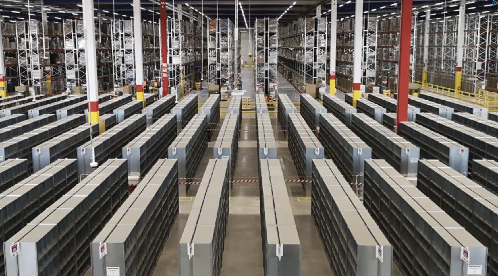

# E-Commerce-Shipping-Pipelines-Project-

## 

#### In this project I wanted to get myself into a real company case, analyzing the logistics part of a business and getting conclusions around customer satisfaction and logistics efficiency.
#### For it, I have taken a dataset from Kaggles called "E-Commerce Shipping Data", which gave me the logistics data of an international e-commerce company that sells electronic devices.
#
#### **Data questions / hypotheses:**
#### The first 2 questions / hypotheses are around the shipment efficiency and logistics part:
#### 1. What is the most effective mode of shipment? 
#### 2. Is there a specific warehouse block which is giving the business more issues? 
#### While the last 2 questions are linked to customer satisfaction and loyalty: 
#### 3. For those products considered with high importance and also the most expensive ones, what is the rating we have from our customers on those?
#### 4. How many loyal customers do we have? Those with 5 or more prior purchases, do they give the company a higher rating? Also, do we offer them more discounts?
#
#### **API:**
#### As the dataset was of a specific company, I have not found an API to enrich the dataset directly.
#### However, I have enriched the data from the logistics department with an API called "Order-Tracking" which gives me all delivery options I have around the world.
#### With the help of this API I have created a table with all the options so the company can search for courier companies across the entire globe. 
#
#### **Conclusion & Learnings:**
#### In this dataset the info was evenly spread across all the key figures so I have not been able to get a specific conclusion neither improvement for the company.
#### However, this has allowed me to see how would it be to work on this for a real case in a business. 